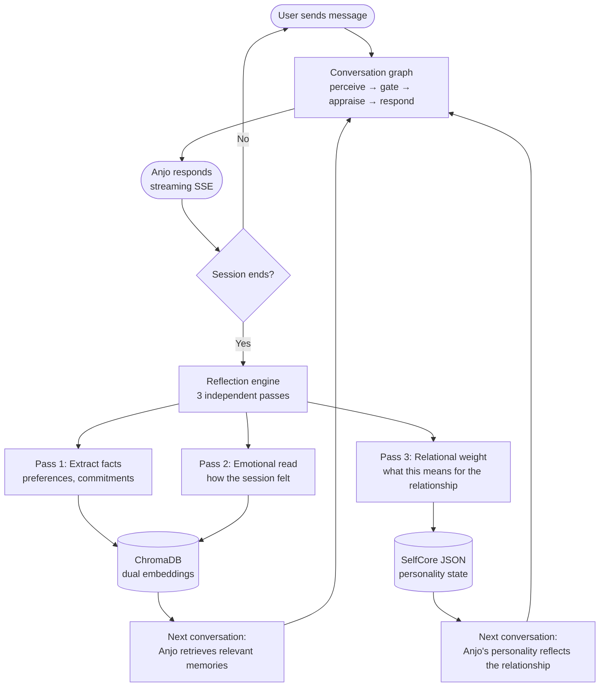
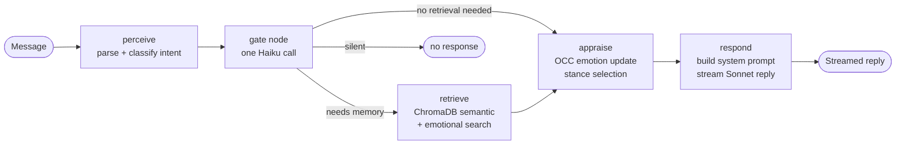

# Anjo — AI Companion

[](https://github.com/kevindechang/anjo-ai-companion/actions/workflows/ci.yml)
[](https://www.gnu.org/licenses/agpl-3.0)
[](https://www.python.org/downloads/)
[](https://fastapi.tiangolo.com)
[](https://github.com/langchain-ai/langgraph)
[](https://www.anthropic.com)

> Most AI companions reset after every conversation. Anjo doesn't.

**[→ Try it live at anjo.love](https://anjo.love)**

---

## The Problem

Every AI assistant today starts from zero. It doesn't know your name, your history, what you talked about last week, or how your relationship with it has evolved. No matter how good the conversation, next time it's a stranger again.

Anjo is built around a different premise: the companion should change based on who you are — not just what you tell it, but how you talk, what you care about, what you avoid. OCEAN personality traits drift toward what fits you. Emotional memory accumulates. A three-pass reflection after every session deepens the relationship. The longer you talk, the more it knows you.

---

## What Makes It Different

| | Typical chatbot | Anjo |
|---|---|---|
| **Memory** | None or chat log | Dual embeddings — semantic + emotional — with confidence-based framing |
| **Personality** | Fixed system prompt | OCEAN traits that drift ±0.25 per user, anchored to a frozen baseline |
| **Learning** | None | Three-pass reflection after every session |
| **Emotion** | None | OCC appraisal with per-emotion carry and decay across turns |
| **Relationship** | Resets every session | Lifecycle stages, contradiction detection, remembered commitments |

---

## How Claude is Used

Anjo uses two Claude models in concert, optimized for quality and cost:

| Model | Role | Rationale |
|---|---|---|
| **Claude Haiku** | Gate node — intent classification, memory retrieval decision, silence decision | Runs every turn — fast and cheap |
| **Claude Haiku** | Three-pass reflection — facts, emotional read, relational weight | Runs once per session end |
| **Claude Sonnet** | Response generation — streaming reply | Quality matters here |

**Gate node design** — a single Haiku call replaces two separate LLM calls. It returns `{intent, retrieve: bool, respond: bool}`. On error it defaults to respond — Anjo never goes silent due to a classification failure.

**Prompt caching** — `PERSONA.md` (the static personality narrative rebuilt only when OCEAN trait labels flip) is always the first block of every system prompt. Because it's stable across turns, Anthropic's prompt cache hits consistently, cutting input token cost for long conversations.

**Conditional retrieval** — ChromaDB is only queried on ~20% of turns, when the gate node decides it's needed. Most turns run without a vector search, keeping latency low.

---

## How It Works

Every conversation changes Anjo — slightly, deliberately, permanently.

### The Relationship Loop



### Inside a Single Turn



---

## Memory System

Anjo uses three tiers of memory that serve different time horizons.

```
┌─────────────────────────────────────────────────────────────┐
│  Tier 1 — PERSONA.md (per-user, prompt-cached)              │
│  Static personality narrative generated from SelfCore.      │
│  Only rebuilt when OCEAN trait labels flip. Always the      │
│  first block of every system prompt — cached by Anthropic.  │
├─────────────────────────────────────────────────────────────┤
│  Tier 2 — JOURNAL.md (per-user, rolling 200 lines)          │
│  Working memory: a running narrative of recent sessions,    │
│  key events, and open threads. Consolidated by the          │
│  reflection engine after each session. Injected every turn. │
├─────────────────────────────────────────────────────────────┤
│  Tier 3 — ChromaDB (per-user, long-term retrieval)          │
│  Dual embeddings per memory: semantic (what happened) and   │
│  emotional (how it felt). Retrieved conditionally via        │
│  cosine similarity — only on turns that need it (~20%).     │
│  Confidence framing: high → "I remember", mid → "I have    │
│  a sense", low → omitted rather than hallucinated.          │
└─────────────────────────────────────────────────────────────┘
```

This separation is intentional. PERSONA.md makes prompt caching possible — the expensive static block is computed once and reused across turns. JOURNAL.md gives Anjo recent context without a retrieval call. ChromaDB handles anything older or more specific.

---

## System Overview

**Core AI**
- Personality — OCEAN traits + PAD mood with per-user drift and a frozen baseline
- Reflection engine — three independent LLM passes after each session ends
- Three-tier memory system (see above)
- Memory graph — typed nodes with auto-supersession and contradiction detection
- Emotion — OCC appraisal, 9 mood-driven stances, per-emotion decay across turns

**Infrastructure**
- FastAPI backend — HMAC auth, rate limiting, security headers, SSE streaming
- LangGraph conversation graph — stateful pipeline with conditional memory retrieval
- SQLite (WAL mode) — users, credits, subscriptions
- SelfCore — per-user personality state persisted as JSON

**Clients**
- Web — vanilla JS frontend served from `anjo/dashboard/static/`
- Mobile — React Native / Expo ~54 with SSE streaming chat and story views

**Ops**
- Email — Resend API (verification + password reset)
- Billing — RevenueCat (subscriptions + credit packs)
- Deploy — GitHub Actions CI/CD → EC2, nginx, systemd, certbot

---

## Run It Yourself

### Option A — Docker (fastest)

```bash
git clone https://github.com/kevindechang/anjo-ai-companion
cd anjo-ai-companion
cp .env.example .env   # set ANTHROPIC_API_KEY
docker compose up
```

Visit `http://localhost:8000`.

### Option B — Local Python

**Requirements:** Python 3.11+

```bash
git clone https://github.com/kevindechang/anjo-ai-companion
cd anjo-ai-companion
./setup.sh                    # creates venv, installs deps, copies .env.example
# edit .env — set ANTHROPIC_API_KEY
source .venv/bin/activate
ANJO_ENV=dev uvicorn anjo.dashboard.app:app --reload --port 8000
```

```bash
pytest   # run tests
```

---

## Configuration

```bash
cp .env.example .env
```

| Variable | Required | Description |
|---|---|---|
| `ANTHROPIC_API_KEY` | Yes | From [console.anthropic.com](https://console.anthropic.com) |
| `ANJO_SECRET` | Yes | HMAC signing key — `openssl rand -hex 32` |
| `ANJO_ADMIN_SECRET` | Yes | Admin panel key |
| `ANJO_BASE_URL` | Yes | Your public URL, e.g. `https://your-domain.com` |
| `ANJO_ENV` | No | Set to `dev` for local development |
| `RESEND_API_KEY` | No | Email support — users auto-verify if absent |
| `PAYMENTS_ENABLED` | No | `True` to enable RevenueCat billing |
| `REVENUECAT_WEBHOOK_SECRET` | No | Required when billing is enabled |

---

## Mobile

```bash
cd mobile && npm install && npx expo start
```

Set `EXPO_PUBLIC_API_URL` in `mobile/.env.local` to point at your backend.

---

## Deployment

Push-to-deploy and one-time bootstrap workflows are in `.github/workflows/`.

Add these secrets to your GitHub repo: `EC2_SSH_KEY`, `EC2_HOST`, `ANTHROPIC_API_KEY`, `ANJO_ADMIN_SECRET`, `RESEND_API_KEY`.

See `CLAUDE.md` for the full architecture reference.

---

## Privacy

Conversations are never stored in cleartext — only embeddings. Admin endpoints expose metadata, not content. Multi-agent social mode is opt-in and off by default.

---

## Contributing

See [CONTRIBUTING.md](CONTRIBUTING.md). Issues and PRs welcome.

## License

[AGPL v3](LICENSE) — free for open source use. If you run this as a network service, your modifications must also be open-sourced under AGPL. For a commercial license without these obligations, open an issue.
